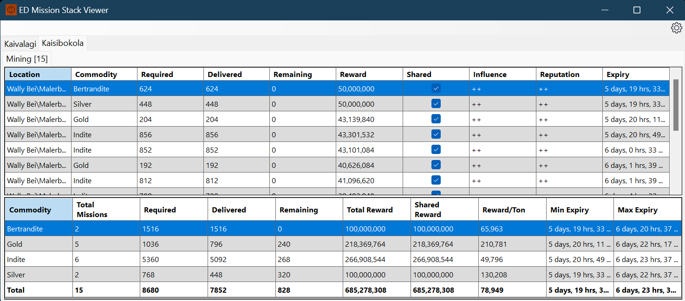

# ED Mission Stack Viewer

This is a .net core 8 C# based windows form based application which preloads all the Elite Dangerous journal files it can find in given folders (defaults to the standard Saved Games location) and then proceeds to watch for changes and update for these accordingly.

This tool supports multiple commanders being displayed and updated for at the same time.

The tool currently displays useful information about four mission types which tend to be what are stacked most given their shareable nature, these are:
- Collect
- Courier
- Massacre
- Mining

**Please note:** I initially tested earlier python code with all mission types supported but since writing this c# application I have mainly been testing using mining missions, so if there are issues with other mission types raise an issue!
